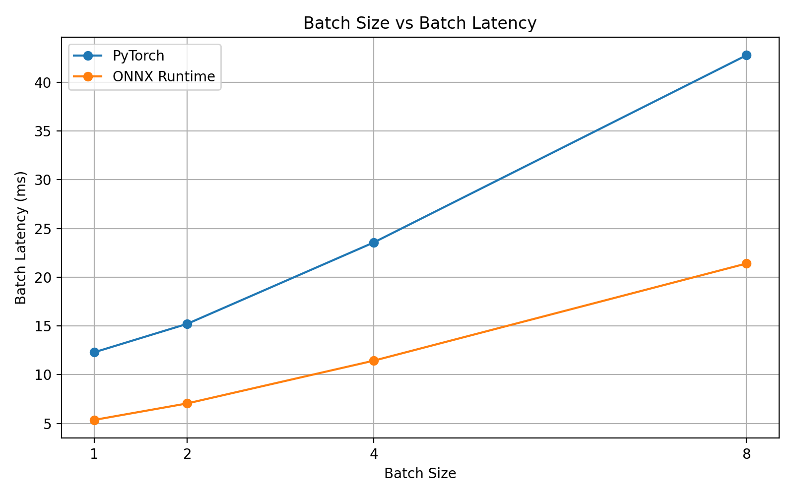
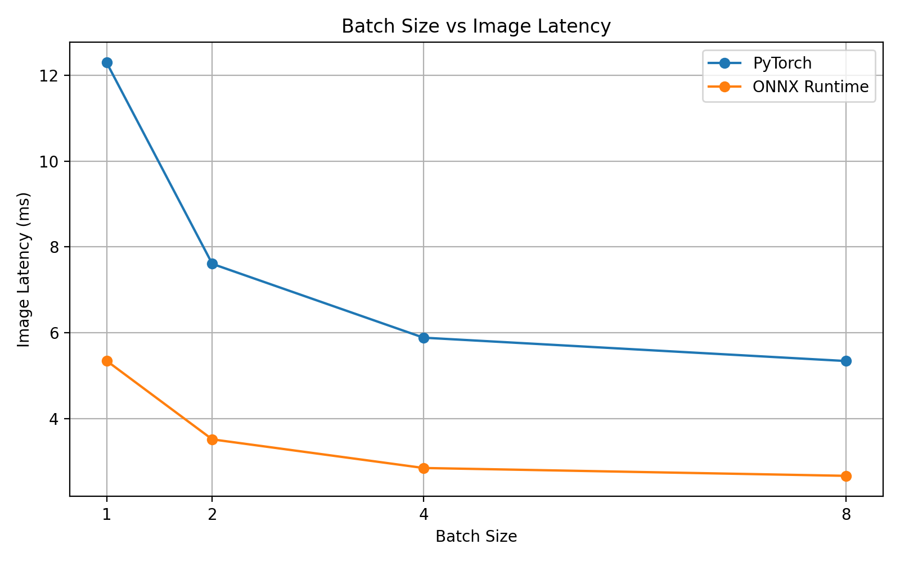
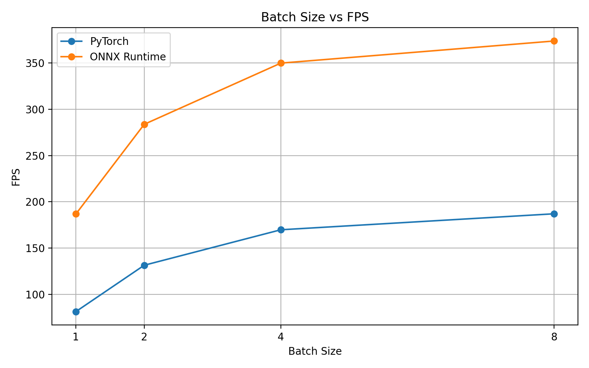
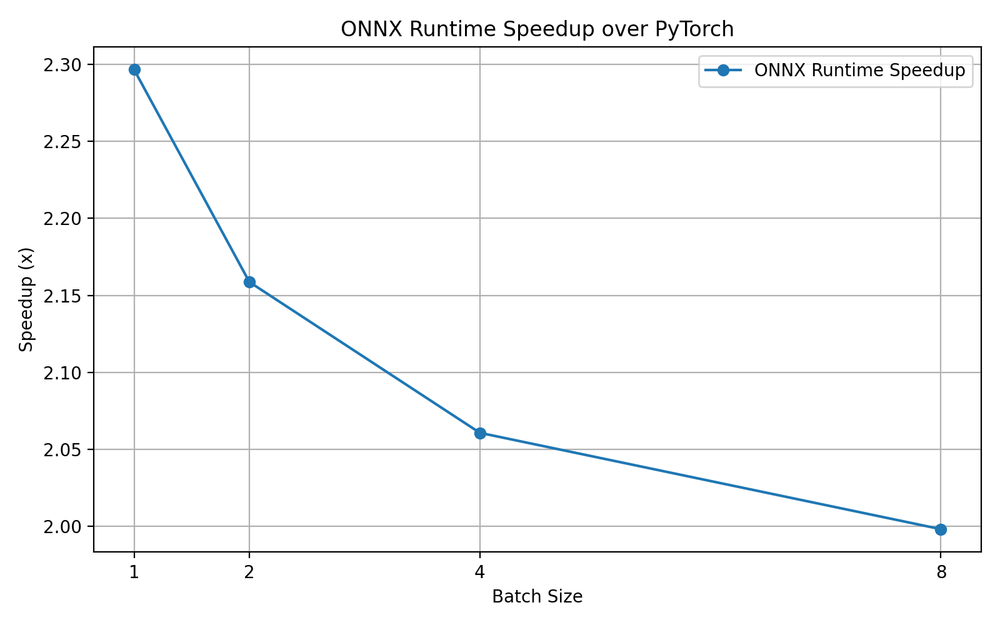

# Edge AI ONNX Runtime Benchmark

基于 PyTorch 与 ONNX Runtime 的轻量化图像分类模型部署与推理优化系统。

本项目实现了一个完整的端侧 AI 推理部署流程，覆盖 PyTorch 模型推理、ONNX 模型导出、ONNX Runtime 部署推理、结果一致性验证、batch size 性能测试与可视化分析。

## 1. Project Overview

在端侧 AI 和边缘智能场景中，模型不能只停留在训练框架中，还需要转换成更适合部署和推理优化的格式。

本项目以 ImageNet 预训练 ResNet18 为基础模型，完成从 PyTorch 到 ONNX Runtime 的推理部署流程，并在 CPU 环境下对比 PyTorch 与 ONNX Runtime 的推理性能。

核心目标包括：

* 跑通 PyTorch 图像分类推理流程
* 将 PyTorch 模型导出为 ONNX 格式
* 使用 ONNX Runtime 加载 ONNX 模型并完成 CPU 推理
* 验证 ONNX Runtime 与 PyTorch 输出结果的一致性
* 测试不同 batch size 下的推理延迟、FPS 和加速比
* 将性能结果保存为 CSV 并生成可视化曲线

## 2. Tech Stack

* Python
* PyTorch
* torchvision
* ONNX
* ONNX Runtime
* NumPy
* Pandas
* Matplotlib
* Pillow
* Git

## 3. Project Structure

```text
edge_ai_onnx_project
├── configs
│   └── experiment_config.json
├── docs
│   ├── INTERVIEW_QA.md
│   ├── daily_logs
│   ├── resume
│   └── review
├── images
│   ├── cat.jpg
│   └── test.jpg
├── models
│   ├── resnet18_imagenet.onnx
│   └── resnet18_imagenet_dynamic.onnx
├── results
│   ├── day6_batch_benchmark.csv
│   └── day7_figures
├── scripts
│   ├── day2_pytorch_inference.py
│   ├── day3_real_image_inference.py
│   ├── day4_export_onnx.py
│   ├── day5_onnxruntime_inference.py
│   ├── day6_batch_benchmark.py
│   ├── day7_plot_curves.py
│   └── run_all_pipeline.py
├── .gitignore
├── GITHUB_UPLOAD_GUIDE.md
├── README.md
├── requirements.txt
└── run_pipeline.bat
```

说明：`models/*.onnx` 文件较大，已在 `.gitignore` 中忽略。ONNX 模型可以通过脚本重新生成。

## 4. Quick Start

### 4.1 Create Environment

```bash
conda create -n edge_ai python=3.10 -y
conda activate edge_ai
pip install -r requirements.txt
```

如果不使用 `requirements.txt`，也可以手动安装核心依赖：

```bash
pip install torch torchvision torchaudio
pip install numpy pandas matplotlib pillow opencv-python
pip install onnx onnxruntime onnxscript
```

### 4.2 Run Full Pipeline

```bash
python scripts/run_all_pipeline.py --image images/cat.jpg --skip_day2
```

该命令会依次运行：

* PyTorch 真实图片推理
* PyTorch 模型导出 ONNX
* ONNX Runtime 推理与 PyTorch 对比
* batch size 性能测试
* 性能曲线生成

如果希望运行 Day 2 的 PyTorch 随机输入 smoke test，可以去掉 `--skip_day2`：

```bash
python scripts/run_all_pipeline.py --image images/cat.jpg
```

Windows 用户也可以直接运行：

```bash
run_pipeline.bat
```

## 5. Main Scripts

| Script                                  | Function                    |
| --------------------------------------- | --------------------------- |
| `scripts/day2_pytorch_inference.py`     | PyTorch 随机输入推理测试            |
| `scripts/day3_real_image_inference.py`  | 真实图片 PyTorch 分类推理           |
| `scripts/day4_export_onnx.py`           | PyTorch 模型导出 ONNX           |
| `scripts/day5_onnxruntime_inference.py` | ONNX Runtime 推理与 PyTorch 对比 |
| `scripts/day6_batch_benchmark.py`       | 不同 batch size 下的推理性能测试      |
| `scripts/day7_plot_curves.py`           | 根据 CSV 生成性能曲线图              |
| `scripts/run_all_pipeline.py`           | 一键运行完整流程                    |

## 6. Experimental Results

### 6.1 Single Image Inference

| Image    | Runtime      | Top-1 Result | Avg Latency ms |    FPS | Speedup |
| -------- | ------------ | ------------ | -------------: | -----: | ------: |
| cat.jpg  | PyTorch      | Egyptian cat |         12.930 |  77.34 |   1.00x |
| cat.jpg  | ONNX Runtime | Egyptian cat |          4.851 | 206.16 |   2.67x |
| test.jpg | PyTorch      | Pomeranian   |         11.021 |  90.73 |   1.00x |
| test.jpg | ONNX Runtime | Pomeranian   |          4.601 | 217.34 |   2.40x |

在两张测试图片上，PyTorch 与 ONNX Runtime 的 Top-5 分类结果保持一致，logits 最大绝对误差约为 `1e-5`。

### 6.2 Batch Size Benchmark

| Batch size | PyTorch batch latency ms | ONNX batch latency ms | PyTorch FPS | ONNX FPS | Speedup | Max diff |
| ---------: | -----------------------: | --------------------: | ----------: | -------: | ------: | -------: |
|          1 |                   12.290 |                 5.352 |       81.37 |   186.85 |   2.30x | 0.000008 |
|          2 |                   15.216 |                 7.049 |      131.44 |   283.74 |   2.16x | 0.000008 |
|          4 |                   23.561 |                11.433 |      169.77 |   349.87 |   2.06x | 0.000008 |
|          8 |                   42.773 |                21.405 |      187.04 |   373.75 |   2.00x | 0.000008 |

实验结果表明，ONNX Runtime 在所有 batch size 下均明显快于 PyTorch，并保持稳定的输出一致性。

## 7. Visualization

### Batch Size vs Batch Latency



### Batch Size vs Image Latency



### Batch Size vs FPS



### ONNX Runtime Speedup over PyTorch



## 8. Key Findings

本项目得到以下结论：

* ONNX Runtime 可以正确加载由 PyTorch 导出的 ONNX 模型
* ONNX Runtime 与 PyTorch 的 Top-K 分类结果基本一致
* 两者 logits 最大绝对误差约为 `1e-5`
* 在 CPU 推理场景下，ONNX Runtime 相比 PyTorch 实现约 `2.00x` 到 `2.67x` 的推理加速
* 增大 batch size 可以提升整体 FPS，并降低单图平均推理延迟
* ONNX Runtime 适合作为端侧 AI / 边缘计算场景中的模型部署与推理优化工具

## 9. Resume Highlight

本项目可以作为端侧 AI、模型部署、AI 工程化和边缘智能方向的求职项目。

简历描述示例：

> 围绕端侧 AI 模型部署场景，构建 PyTorch → ONNX → ONNX Runtime 的图像分类推理流程，覆盖模型加载、真实图片预处理、ONNX 导出、部署推理、性能测试与可视化分析；设计 batch size = 1、2、4、8 的推理 benchmark，实验显示 ONNX Runtime 在 CPU 上相比 PyTorch 实现约 2.00x 到 2.67x 推理加速。

## 10. Future Work

后续可以继续扩展：

* 对比 ResNet18 与 MobileNetV2 的模型大小、延迟和 FPS
* 增加 ONNX 动态量化实验
* 测试推理过程中的内存占用
* 增加多图片批量推理功能
* 在 Linux 或真实边缘设备上部署
* 尝试 TensorRT、OpenVINO、NCNN 等推理后端
* 增加更完整的命令行参数和配置文件读取逻辑

## 11. Project Status

当前项目状态：

* PyTorch 推理流程：完成
* ONNX 导出：完成
* ONNX Runtime 推理：完成
* 输出一致性验证：完成
* batch size benchmark：完成
* 性能曲线可视化：完成
* README 与面试材料：完成
* Git 版本管理：完成

该项目已经形成一个可运行、可展示、可讲解的端侧 AI 模型部署项目雏形。
